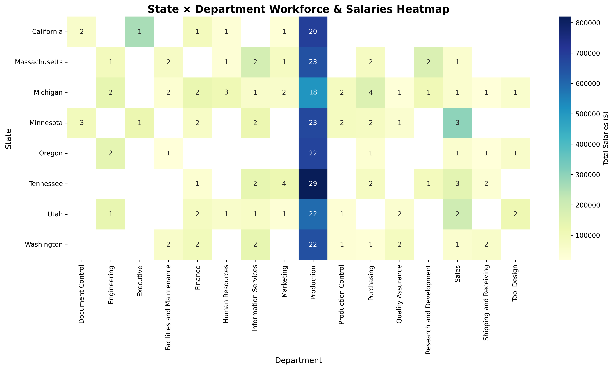

# HR Data Analysis: Workforce & Salary Insights Dashboard

## 📊 Project Summary
This project focuses on analyzing HR data to uncover actionable insights about the workforce — including employee distribution, departmental performance, salary trends, and demographic diversity.  
Using Python, Power BI, and visualization libraries like Matplotlib and Plotly, the analysis explores how salaries and employees vary across departments, genders, and locations, helping HR teams make data-driven decisions.

---

## 💡 Business Problem
Human Resource departments often manage scattered employee data across systems and spreadsheets. Without structured analysis, decision-making around hiring, retention, and salary benchmarking becomes slow and reactive.

**Problem Statement:**  
How can HR data be analyzed to identify patterns in salaries, gender representation, departmental performance, and workforce growth trends to guide better business decisions?

---

## 🎯 Objectives
- Clean and integrate HR employee data for consistent analysis.  
- Evaluate total and average salaries by **department**, **state**, and **gender**.  
- Identify high-cost departments and regions driving payroll spending.  
- Track hiring patterns and headcount growth over time.  
- Visualize pay distribution to detect potential gender or regional disparities.  
- Deliver clear and interactive visuals for executive decision-making.

---

## 🧩 Data Overview
The dataset contains employee details such as:
- **Employee ID, Name, Gender, Department**
- **Hire Date, Birth Date, Job Title**
- **Location (State/Province)**
- **Salary, Bonus, and Pay Grade**

---

## 🧠 Methodology
1. **Data Cleaning & Transformation**
   - Removed duplicates, handled missing values.
   - Standardized date formats and categorical columns.
   - Converted salary fields to numeric for computation.

2. **Exploratory Data Analysis (EDA)**
   - Distribution of employees by gender, department, and location.
   - Salary comparison across genders and departments.
   - Correlation between hire date, salary, and department size.

3. **Visualization & Reporting**
   - Used **Matplotlib**, **Seaborn**, and **Plotly** for visuals.
   - Built KPI visuals for Power BI dashboard integration.

---

## 📈 Key Visuals & Insights

### 1️⃣ Total Salaries by US State


- California and Minnesota dominate total payroll costs.  
- Total salaries across 8 states exceed **$10.6M** across 284 employees.  
- Western and Midwestern regions lead in total workforce cost concentration.

---

### 2️⃣ Average Salary per Employee by State


- **California** leads with an average salary of **$44,644**, followed by **Minnesota** and **Massachusetts**.  
- Indicates strong compensation competitiveness in coastal states.

---

### 3️⃣ Average Annual Salary Trend Across Years


- Clear upward trajectory post-2010, peaking at **$100,050** by 2013.  
- Suggests recent hiring cycles focus on higher-pay roles, possibly management and tech.

---

### 4️⃣ Salary vs. Age Relationship


- Positive but **weak correlation** between age and salary.  
- Younger employees are distributed across wide salary ranges, indicating merit-based or role-based compensation.

---

### 5️⃣ Workforce & Salary Distribution by State × Department


- Production and Information Services dominate headcount and salary share across all states.  
- **Tennessee** and **California** show the highest department concentration and salary totals.  
- Highlights potential over-staffing or cost concentration zones.

---

## 🧮 Tools & Libraries Used
```py
pandas
numpy
matplotlib
seaborn
plotly
datetime
os
