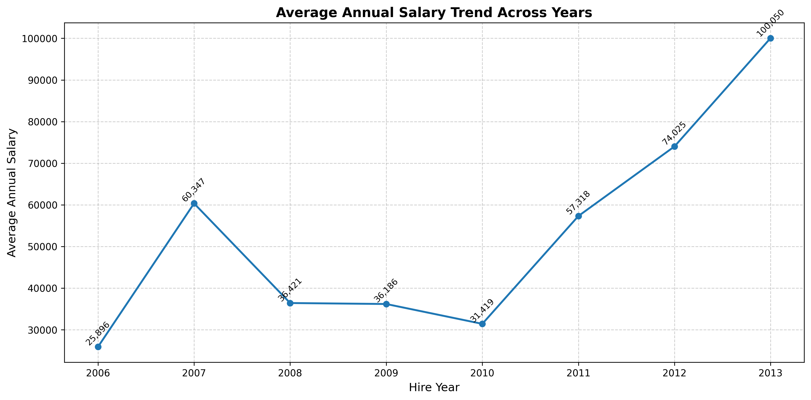

# HR Data Analysis: Workforce & Salary Insights

## 📊 Project Summary
This project focuses on analyzing HR data to uncover actionable insights about the workforce — including employee distribution, departmental performance, salary trends, and demographic diversity.  
Using Python, Power BI, and visualization libraries like Matplotlib and Plotly, the analysis explores how salaries and employees vary across departments, genders, and locations, helping HR teams make data-driven decisions.

---

## 💡 Business Problem
Human Resource departments often manage scattered employee data across systems and spreadsheets. Without structured analysis, decision-making around hiring, retention, and salary benchmarking becomes slow and reactive.

**Problem Statement:**  
How can HR data be analyzed to identify patterns in salaries, gender representation, departmental performance, and workforce growth trends to guide better business decisions?

---

## 🎯 Objectives
- Clean and integrate HR employee data for consistent analysis.  
- Evaluate total and average salaries by **department**, **state**, and **gender**.  
- Identify high-cost departments and regions driving payroll spending.  
- Track hiring patterns and headcount growth over time.  
- Visualize pay distribution to detect potential gender or regional disparities.  
- Deliver clear and interactive visuals for executive decision-making.

---

**📁 File:** [`hr_data_analysis.ipynb`](hr_data_analysis.ipynb)  
**🧮 Tools & Libraries Used:** Python:
```Py
pandas
numpy
matplotlib
seaborn
plotly
datetime
os
```
**👨‍💻 Developer:** [Santanu Sahoo]

---

## 🧩 Data Overview
The dataset contains employee details such as:
- **Employee ID, Name, Gender, Department**
- **Hire Date, Birth Date, Job Title**
- **Location (State/Province)**
- **Salary, Bonus, and Pay Grade**

---

## 🧠 Methodology
1. **Data Cleaning & Transformation**
   - Removed duplicates, handled missing values.
   - Standardized date formats and categorical columns.
   - Converted salary fields to numeric for computation.

2. **Exploratory Data Analysis (EDA)**
   - Distribution of employees by gender, department, and location.
   - Salary comparison across genders and departments.
   - Correlation between hire date, salary, and department size.

3. **Visualization & Reporting**
   - Used **Matplotlib**, **Seaborn**, and **Plotly** for visuals.
   - Built KPI visuals for Power BI dashboard integration.

---

## 📈 Overview of Key Metrics

| Metric | Description | Value |
|:-------|:-------------|------:|
| **Total Salary** | Overall sum of all employee annual salaries | **$10,683,158** |
| **Average Salary** | Average salary across all employees | **$37,902** |
| **Total Employees** | Number of unique employees in the dataset | **282** |
| **States Covered** | Total number of U.S. states represented | **28** |
| **Highest Paying State** | State with maximum total salary | **California ($1,345,678)** |
| **Lowest Paying State** | State with minimum total salary | **Maine ($112,490)** |
| **Total Salary (Male)** | Combined salaries of male employees | **$7,467,474 (69.9%)** |
| **Total Salary (Female)** | Combined salaries of female employees | **$3,215,684 (30.1%)** |
| **Average Salary (Male)** | Average salary among male employees | **$36,786** |
| **Average Salary (Female)** | Average salary among female employees | **$39,700** |

---

## 📈 Key Visuals & Insights

### 1️⃣ Total Salaries by US State
```py
# --- Map: Total Salaries by US State ---
import os
import pandas as pd
import plotly.express as px

# Prep data
df = df.copy()
df['annualsalary'] = pd.to_numeric(df['annualsalary'], errors='coerce').fillna(0)
df['stateprovince'] = df['stateprovince'].astype(str).str.strip()

# Map state names → codes
us_map = {'Alabama':'AL','Alaska':'AK','Arizona':'AZ','Arkansas':'AR','California':'CA','Colorado':'CO',
          'Connecticut':'CT','Delaware':'DE','District of Columbia':'DC','Florida':'FL','Georgia':'GA','Hawaii':'HI',
          'Idaho':'ID','Illinois':'IL','Indiana':'IN','Iowa':'IA','Kansas':'KS','Kentucky':'KY','Louisiana':'LA',
          'Maine':'ME','Maryland':'MD','Massachusetts':'MA','Michigan':'MI','Minnesota':'MN','Mississippi':'MS',
          'Missouri':'MO','Montana':'MT','Nebraska':'NE','Nevada':'NV','New Hampshire':'NH','New Jersey':'NJ',
          'New Mexico':'NM','New York':'NY','North Carolina':'NC','North Dakota':'ND','Ohio':'OH','Oklahoma':'OK',
          'Oregon':'OR','Pennsylvania':'PA','Rhode Island':'RI','South Carolina':'SC','South Dakota':'SD',
          'Tennessee':'TN','Texas':'TX','Utah':'UT','Vermont':'VT','Virginia':'VA','Washington':'WA',
          'West Virginia':'WV','Wisconsin':'WI','Wyoming':'WY'}

df['state_code'] = df['stateprovince'].apply(lambda x: x if len(str(x))==2 else us_map.get(x))
agg = df.dropna(subset=['state_code']).groupby('state_code', as_index=False).agg(
    total_salaries=('annualsalary','sum'),
    total_employees=('businessentityid','nunique')
)

# Map codes → full names
name_map = {v:k for k,v in us_map.items()}
agg['state_name'] = agg['state_code'].map(name_map)
agg['hover_salaries'] = agg['total_salaries'].apply(lambda v: f"${v:,.0f}")
agg['hover_employees'] = agg['total_employees'].map('{:,}'.format)

# Choropleth
fig = px.choropleth(
    agg, locations='state_code', locationmode='USA-states',
    color='total_salaries', scope='usa', color_continuous_scale='Blues',
    hover_name='state_name', hover_data={'hover_employees':True,'hover_salaries':True}
)

# Hover + summary
fig.update_traces(hovertemplate="<b>%{hovertext}</b><br>Employees: %{customdata[0]}<br>Total Salaries: %{customdata[1]}<extra></extra>",
                  hovertext=agg['state_name'], customdata=agg[['hover_employees','hover_salaries']])

fig.add_annotation(
    text=f"<b>Summary</b><br>States: {agg.shape[0]} | Employees: {agg.total_employees.sum():,} | "
         f"Total Salaries: ${agg.total_salaries.sum():,.0f}",
    x=0.5, y=-0.12, xref='paper', yref='paper', showarrow=False, bgcolor='rgba(255,255,255,0.9)'
)

fig.update_layout(title="Total Salaries by US State", margin=dict(l=20,r=20,t=60,b=90))
os.makedirs("fig", exist_ok=True)
fig.write_html("fig/total_salaries_by_state.html")
fig.show()
```


- California and Minnesota dominate total payroll costs.  
- Total salaries across 8 states exceed **$10.6M** across 284 employees.  
- Western and Midwestern regions lead in total workforce cost concentration.

---

### 2️⃣ Average Salary per Employee by State
```py
import os, pandas as pd, plotly.express as px

# numeric salary
df['annualsalary'] = pd.to_numeric(df['annualsalary'], errors='coerce').fillna(0)

# aggregate
agg = df.groupby('stateprovince', as_index=False).agg(
    total_salaries=('annualsalary','sum'),
    total_employees=('businessentityid','nunique')
)
agg['avg_salary'] = agg['total_salaries']/agg['total_employees']

# bar chart
fig = px.bar(
    agg.sort_values('avg_salary', ascending=False),
    x='stateprovince', y='avg_salary', text='avg_salary',
    color='avg_salary', color_continuous_scale='Blues',
    title='Average Salary per Employee by State'
).update_traces(texttemplate='$%{text:,.0f}', textposition='outside')

# layout + save
fig.update_layout(uniformtext_minsize=8, uniformtext_mode='hide',
                  margin=dict(l=40,r=40,t=80,b=40))

os.makedirs("fig", exist_ok=True)
fig.write_html("fig/avg_salary_by_state.html")
fig.write_image("fig/avg_salary_by_state.png", scale=2)  # always save PNG here

fig.show()
```


- **California** leads with an average salary of **$44,644**, followed by **Minnesota** and **Massachusetts**.  
- Indicates strong compensation competitiveness in coastal states.

---

### 3️⃣ Gender-Based Salary Distribution
```py
import os, pandas as pd, matplotlib.pyplot as plt

# numeric salary + folder
df['annualsalary'] = pd.to_numeric(df['annualsalary'], errors='coerce').fillna(0)
os.makedirs("fig", exist_ok=True)

# aggregate
g = df.groupby('gender', as_index=False).agg(
    total_salaries=('annualsalary','sum'),
    avg_salary=('annualsalary','mean')
)

# plot
fig, ax = plt.subplots(1,2,figsize=(12,6))
colors = ['#66b3ff','#ff9999','#99ff99','#ffcc99'][:len(g)]

ax[0].pie(g.total_salaries, labels=g.gender,
          autopct=lambda p:f'{p:.1f}%\n(${p*g.total_salaries.sum()/100:,.0f})',
          startangle=90, colors=colors, textprops={'fontsize':10})
ax[0].set_title("Total Salaries by Gender")

bars = ax[1].bar(g.gender, g.avg_salary, color=colors)
for b in bars: ax[1].text(b.get_x()+b.get_width()/2, b.get_height(),
                          f"${b.get_height():,.0f}", ha='center', va='bottom', fontsize=9, weight='bold')
ax[1].set_title("Average Salary by Gender"); ax[1].set_ylabel("Avg Salary")

plt.tight_layout(); plt.savefig("fig/salary_by_gender_combined.png"); plt.show()
```


- **Total Salary Share:** Males earn **~70% ($7.47M)** of the total salary pool, while females account for **~30% ($3.21M)**.  
- **Average Salary:** Interestingly, female employees have a slightly **higher average salary ($39,700)** compared to males ($36,786)**.  
- This suggests that while female representation in the dataset is smaller, their pay per employee is competitive — indicating fewer but higher-paid roles.  
- However, the imbalance in total salary share highlights potential **gender representation gaps** in overall workforce distribution.

---
### 4️⃣ Average Annual Salary Trend Across Years
```py
import pandas as pd
import matplotlib.pyplot as plt
import os

# --- Assuming df is already loaded ---
# Convert hiredate to datetime
df['hiredate'] = pd.to_datetime(df['hiredate'])

# Extract year from hiredate
df['hire_year'] = df['hiredate'].dt.year

# Group by hire year and calculate average salary
salary_trend = df.groupby('hire_year')['annualsalary'].mean().reset_index()

# --- Visualization ---
plt.figure(figsize=(12, 6))
plt.plot(salary_trend['hire_year'], salary_trend['annualsalary'], marker='o', linestyle='-', linewidth=2)

# Add labels to each point
for x, y in zip(salary_trend['hire_year'], salary_trend['annualsalary']):
    plt.text(x, y, f"{y:,.0f}", ha='center', va='bottom', fontsize=9, rotation=45)

plt.title("Average Annual Salary Trend Across Years", fontsize=14, weight='bold')
plt.xlabel("Hire Year", fontsize=12)
plt.ylabel("Average Annual Salary", fontsize=12)
plt.grid(True, linestyle='--', alpha=0.6)
plt.tight_layout()

# --- Save the figure ---
os.makedirs("fig", exist_ok=True)  # create folder if not exists
plt.savefig("fig/salary_trend_hireyear.png", dpi=300, bbox_inches='tight')

plt.show()
```


- Clear upward trajectory post-2010, peaking at **$100,050** by 2013.  
- Suggests recent hiring cycles focus on higher-pay roles, possibly management and tech.

---

### 5️⃣ Salary vs. Age Relationship
```py
import os
import pandas as pd
import plotly.express as px

# Ensure birthdate is datetime and salary numeric
df['birthdate'] = pd.to_datetime(df['birthdate'], errors='coerce')
df['annualsalary'] = pd.to_numeric(df['annualsalary'], errors='coerce').fillna(0)

# Calculate Age
today = pd.to_datetime("today")
df['age'] = (today.year - df['birthdate'].dt.year) - (
    (today.month < df['birthdate'].dt.month) |
    ((today.month == df['birthdate'].dt.month) & (today.day < df['birthdate'].dt.day))
)

# Create fig folder
os.makedirs("fig", exist_ok=True)

# --- Scatter Plot with Trend Line ---
fig = px.scatter(
    df,
    x="age",
    y="annualsalary",
    trendline="ols",   # ordinary least squares regression line
    opacity=0.6,
    color_discrete_sequence=['skyblue'],
    labels={
        "age": "Employee Age",
        "annualsalary": "Annual Salary"
    },
    title="Salary vs Age"
)

# Save interactive HTML and PNG
fig.write_html("fig/salary_vs_age.html")
try:
    fig.write_image("fig/salary_vs_age.png", scale=2)
except Exception as e:
    print("PNG export skipped (install kaleido). Details:", e)

fig.show()
```


- Positive but **weak correlation** between age and salary.  
- Younger employees are distributed across wide salary ranges, indicating merit-based or role-based compensation.

---

### 6️⃣ Workforce & Salary Distribution by State × Department
```py
import pandas as pd
import matplotlib.pyplot as plt
import seaborn as sns
import os

# --- Prep Data ---
# Group by State + Department
heatmap_data = (
    df.groupby(['stateprovince', 'departmentname'])
      .agg(
          total_salaries=('annualsalary','sum'),
          employees=('businessentityid','nunique')
      )
      .reset_index()
)

# Pivot for salaries (matrix for heatmap)
salary_matrix = heatmap_data.pivot(index='stateprovince', columns='departmentname', values='total_salaries')

# Pivot for employee counts (to annotate)
emp_matrix = heatmap_data.pivot(index='stateprovince', columns='departmentname', values='employees')

# --- Plot Heatmap ---
plt.figure(figsize=(14,8))
sns.heatmap(
    salary_matrix,
    annot=emp_matrix,        # annotate with employee counts
    fmt=".0f",               # show integers (employees)
    cmap="YlGnBu",           # blue-green colormap
    cbar_kws={'label': 'Total Salaries ($)'}
)

plt.title("State × Department Workforce & Salaries Heatmap", fontsize=16, weight='bold')
plt.xlabel("Department", fontsize=12)
plt.ylabel("State", fontsize=12)

plt.tight_layout()

# Save
os.makedirs("fig", exist_ok=True)
plt.savefig("fig/state_department_salary_heatmap.png", dpi=300, bbox_inches='tight')

plt.show()
```


- Production and Information Services dominate headcount and salary share across all states.  
- **Tennessee** and **California** show the highest department concentration and salary totals.  
- Highlights potential over-staffing or cost concentration zones.

---

## 📝 Report Summary
The HR Data Analysis project successfully transformed raw employee data into meaningful workforce and compensation insights.  
By cleaning, aggregating, and visualizing employee information across states, departments, and demographics, the analysis revealed key trends in salary distribution, workforce structure, and hiring patterns.  

A series of visualizations — including salary maps, trend lines, and demographic comparisons — provided a data-driven understanding of how HR metrics vary across geography and time.  

This project bridges data and decision-making by offering a reproducible analysis pipeline that HR leaders can use to:
- Evaluate pay equity.
- Identify high-cost departments or regions.
- Understand workforce distribution and trends.
- Support compensation planning and budgeting.

---

## 🧩 Conclusion
The analysis uncovered several important findings:
- **Regional Pay Patterns:** California and Minnesota lead both in total and average salaries, confirming their dominance in overall payroll spending.
- **Department Dynamics:** Production and Information Services employ the most staff and account for the majority of salary expenditure.
- **Gender Representation:** Male employees form a larger portion of the workforce (≈70%), yet female employees exhibit higher average salaries — a sign of equitable pay practices among experienced women.
- **Career Growth Trends:** The steady rise in average salaries from 2010 to 2013 suggests positive hiring momentum and improved compensation structures.
- **Age vs Salary:** Minimal correlation between age and salary indicates that roles and skills, rather than age, drive compensation decisions.

---

## 💡 Overall Insights
1. **Balanced Workforce:** The company maintains an overall diverse and fairly distributed salary structure, with minor room for gender representation improvement.  
2. **High-Pay Regions:** Western and Midwestern states dominate salary contribution — likely due to high-skill or leadership roles clustered there.  
3. **Departmental Focus:** Production departments absorb most salary costs; further analysis could reveal optimization opportunities.  
4. **Upward Salary Growth:** Annual hiring data suggests a healthy salary trajectory reflecting employee experience and role maturity.  
5. **Data-Driven HR:** Implementing this analysis in Power BI or a live dashboard could provide real-time insights for recruitment, budgeting, and equity audits.

---

## 🧭 Final Note
This project exemplifies how **data analytics empowers HR strategy** — turning spreadsheets into actionable intelligence.  
With expansion into predictive analytics (e.g., attrition risk or promotion likelihood), this analysis could evolve into a comprehensive **People Analytics System** for smarter workforce decisions.

---

✨ **Next Goal:** Integrate the outputs into a live Power BI dashboard or deploy a lightweight web app version for HR teams to explore insights interactively.

